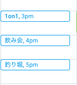

# Terraform vkg Provider

This is a Terraform provider for managing [vkgtaro](https://github.com/vkg/taro).
It enables you to treat "vkgtaro as code"!

## Installation

1. Prepare environment

```sh
$ go get github.com/vkg/terraform-provider-vkg && cd $GOPATH/src/github.com/vkg/terraform-provider-vkg/
$ ./scripts/init.sh
```

## Run

1. Prepare credential and apply

```sh
$ GOOGLE_APPLICATION_CREDENTIALS=/path/to/your/credential.json terraform init
$ GOOGLE_APPLICATION_CREDENTIALS=/path/to/your/credential.json terraform plan
```

## Reference

This is a minimal example.

```hcl
resource "vkg_1on1" "test" {
  start = "2019-06-12 15:00:00"
  end   = "2019-06-12 15:30:00"

  attendee {
    email = "example@example.com"
  }
}

resource "vkg_nomikai" "test" {
  start = "2019-06-12 16:00:00"
  end   = "2019-06-12 16:30:00"

  attendee {
    email = "example@example.com"
    email = "example2@example.com"
  }
}

resource "vkg_tsuribori" "test" {
  start = "2019-06-12 17:00:00"
  end   = "2019-06-12 17:30:00"

  attendee {
    email = "example@example.com"
  }
}
```

Result:



### Arguments

Arguments are provided as inputs to the resource, in the `*.tf` file.

- `start` `(string, required)` 
  - Start time of the event, format is `YYYY-MM-DD HH:MM:DD`

- `end` `(string, required)` 
  - End time of the event, format is `YYYY-MM-DD HH:MM:DD`

- `location` `(string, "")` 
  - Meeting location. If empty, it will be blank.

- `description` `(string, "")` 
  - the long-form description of the event. This can be multiple paragraphs using Terraform's heredoc syntax.

- `transparency` `(string, "transparent")` 
  - specifies that the time should be "blocked" on the calendar (mark as busy). Valid values are:
    - "opaque" - not visible 
    - "transparent" - visible

- `guests_can_invite_others` `(bool, true)` 
  - specifies that guests (attendees) can invite other guests. Set this to false to allow only the organizer to manage the guest list.

- `guests_can_modify` `(bool, true)` 
  - specifies that guests (attendees) can modify the event (change start time, description, etc). Set this to true to give any guest full control over the event.

- `guests_can_see_other_guests` `(bool, true)` 
  - specifies that guests (attendees) can see other guests. Set this to false to restrict the guest list visibility.

- `send_notifications` `(bool, true)` 
  - specifies that email notifications should be sent to guests (attendees). Set this to false to put things on people's calendar's without notifying them.

- `visibility` `(string, "public")` 
  - specifies the visibility for the event. Valid values are:
    - `""` - default inherit from calendar
    - `"public"` - public
    - `"private"` - private

- `attendee` `(list of structures)` 
  - specifies a guest (attendee) to invite to the event. This may be specified more than once to invite multiple people to the same event. The following fields are supported:
    - `email` `(string, required)` 
      - the Google email address of the attendee.
    - `optional` `(bool, false)` 
      - specifies that the guest (attendee) is marked as optional. Set this to true to mark the user as an optional attendee.

### Attributes

Attributes are values that are only known after creation. (Computed values.)

- `event_id` `(string)` 
  - the unique ID of the event on this calendar

- `hangout_link` `(string)` 
  - the HTTPS web link to the attached Google Hangout. In practice, I have been unable to get this link to appear.

- `html_link` `(string)` 
  - the HTTP web link to the calendar invite on [calendar.google.com](https://calendar.google.com/).

## License

MIT
